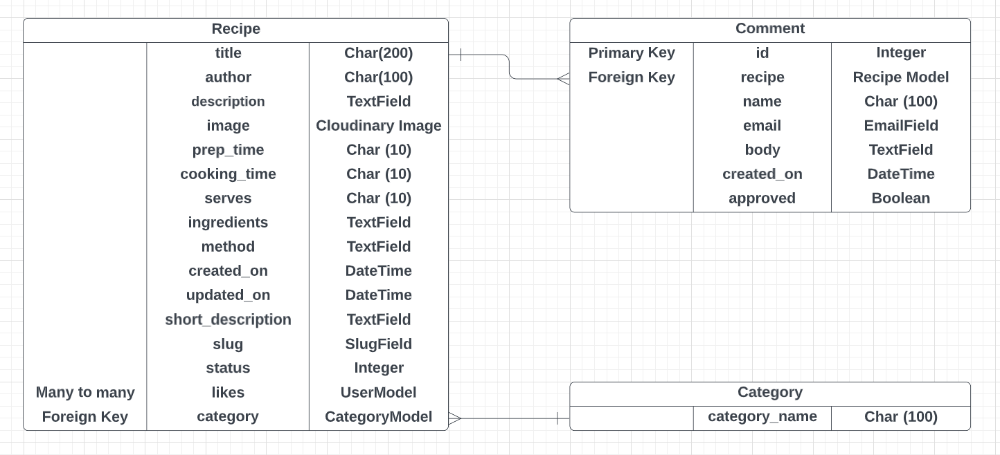

 ## User Stories

- As a user I want to be able to navigate the website easily using the navigation bar links.
- As a user I want to know what the website is about when I enter the website.
- As a user I want to be able to view the most recent recipes on the homepage.
- As a user I want to be able to access full recipes from the homepage.
- As a user I want to be able to access a list of all recipes from the homepage.
- As a user I want to be able to click on a recipe on the “All Recipes” page and view the full details / instructions of the recipe.
- As a user I want to be able to view comments on each individual recipe.
- As a user I want to be able to see how long a recipe would take to make.
- As a user I want to be able to see how many people each recipe serves.
- As a user I want to be able to view the number of likes each recipe has received.
- As a user I want to be able to register and create an account so that I can leave comments on recipes.
- As a user I want to receive confirmation that I have registered successfully.
- As a registered user I want to receive confirmation that I have logged in successfully.
- As a registered user I want to receive confirmation that I have logged out successfully.
- As a registered user I want to be able to log into my account easily.
- As a registered user I want to be able to leave comments on recipes.
- As a registered user I want to be able to “like” / “unlike” recipes.
- As an admin I want to be able to approve comments before they appear on a recipe.
- As an admin I want to be able to delete comments from recipes.
- As an admin I want to be able to create recipes.
- As an admin I want to be able to create and save draft recipes.
- As an admin I want to be able to update recipes.
- As an admin I want to be able to delete recipes.

## Wireframes

### Wireframes for Desktop

I have created wireframes using Balsamiq for Desktop, Tablet and Phone

 - [Homepage](readme-images/wireframes/desktop/homepage-desktop.png)
 - [All Recipes](readme-images/wireframes/desktop/all-recipes-desktop.png)
 - [Recipe Logged In](readme-images/wireframes/desktop/recipe-logged-in-desktop.png)
 - [Recipe Not Logged In](readme-images/wireframes/desktop/recipe-not-logged-in-desktop.png)
 - [Register](readme-images/wireframes/desktop/register-desktop.png)
 - [Login](readme-images/wireframes/desktop/login-desktop.png)

### Wireframes for Tablet
 - [Homepage](readme-images/wireframes/tablet/homepage-tablet.png)
 - [All Recipes](readme-images/wireframes/tablet/all-recipes-tablet.png)
 - [Recipe Logged In](readme-images/wireframes/tablet/recipe-logged-in-tablet.png)
 - [Recipe Not Logged In](readme-images/wireframes/tablet/recipe-not-logged-in-tablet.png)
 - [Register](readme-images/wireframes/tablet/register-tablet.png)
 - [Login](readme-images/wireframes/tablet/login-tablet.png)

### Wireframes for Phone
- [Homepage](readme-images/wireframes/phone/homepage-phone.png)
 - [All Recipes](readme-images/wireframes/phone/all-recipes-phone.png)
 - [Recipe Logged In](readme-images/wireframes/phone/recipe-logged-in-phone.png)
 - [Recipe Not Logged In](readme-images/wireframes/phone/recipe-not-logged-in-phone.png)
 - [Register](readme-images/wireframes/phone/register-phone.png)
 - [Login](readme-images/wireframes/phone/login-phone.png)

## Database Models and Schema

### Recipes
- The Recipes Model contains the information about each recipe on the website.
- The title field is the name of the recipe, and is unique.
- It contains a one-to-many relationship with the Comment Model.
- The title field is the foreign key for this relationship.
It contains a many-to-one relationship with the Category Model.
- The category field is the foreign key for this relationship.
- It contains a many-to-many key for Likes.

### Comments
- The Comments Model contains the content of each comment made on each recipe.
- It contains a many-to-one relationship with the Recipe Model.
- The id field is the primary key for this relationship.

### Category
- The Category model contains an id and category_name fields.
- It contains a one-to-many relationship with the Recipe Model.
- The id field is the primary key for this relationship.

## Database Schema
My database schema was created using Lucid Chart and is displayed in the below diagram.

 

